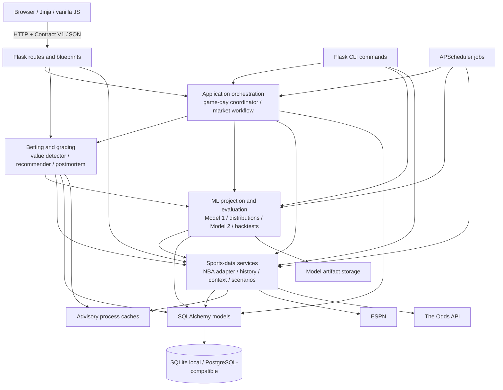

# Edge Tracker System Contract

Status: **canonical architecture SSOT**  
Contract version: **1.0**  
Last verified against `main`: **2026-08-09 (`6b1e400`)**

Verified inventory at this version: **16 SQLAlchemy models**, **22 registered
APScheduler jobs**, and **NBA as the only registered `SportService`**.

This document is the single source of truth for module ownership, allowed
dependencies, cross-module data contracts, and state-management rules in Edge
Tracker. `ARCHITECTURE.md` remains a descriptive overview; when it disagrees
with this contract, this document wins.

Executable definitions remain authoritative for field-level implementation:

- database columns and relationships: `app/models.py` plus Alembic migrations;
- enum values: `app/enums.py`;
- Model 1 inputs: `app/services/ml_feature_builder.py::FEATURE_KEYS`;
- Model 2 inputs: `app/services/pick_quality_model.py::PICK_FEATURES`;
- per-sport historical stat keys: `app/services/sport_config.py`.

This file is the registry that assigns those owners and defines how they may
communicate. Do not create a second architecture or schema document that
competes with it. Proposed changes must update this file and the executable
owner in the same change.

Normative words `MUST`, `MUST NOT`, `SHOULD`, and `MAY` describe requirements.
Sections describing existing producers document current behavior. Forward rules
such as `ApiResultV1` apply immediately to new work; legacy deviations are
listed explicitly and may be migrated incrementally rather than assumed fixed.

## 1. Architecture decision

Edge Tracker is a **modular Flask monolith** with one relational database and
one deployable application unit. It is not a microservice system. Modules
are separated by responsibility so a boundary can be extracted later only if
independent scaling or deployment becomes necessary.

Core principles:

1. SQLAlchemy is the durable source of truth.
2. Routes, CLI commands, and scheduled jobs are entrypoints, not domain layers.
3. Business decisions live in services and policy modules.
4. Provider payloads are normalized before entering business logic.
5. Process-local caches are advisory accelerators and never correctness state.
6. Cross-module payloads use the versioned contracts in this document.
7. Game dates, slate boundaries, scheduler decisions, and freshness checks use
   `ZoneInfo("America/New_York")` (ET).
8. Model training and inference share executable feature contracts.

## 2. System and dependency map



### 2.1 Dependency direction

The allowed direction is:

```text
browser/templates
    -> routes | CLI | scheduler
        -> orchestration and domain services
            -> lower-level services and policies
                -> ORM / model storage / provider adapters
```

| From | May depend on | Must not depend on |
|---|---|---|
| Templates/static JS | rendered data, documented HTTP contracts | Python modules, database layout |
| Routes | forms, contracts, services, ORM for simple user-scoped CRUD | CLI modules, scheduler registration, private functions in another route |
| CLI commands | contracts, services, ORM | routes, templates |
| Scheduler | orchestration functions and narrowly scoped jobs | routes, templates, browser state |
| Orchestration services | domain services, ORM, contracts | routes, CLI registration |
| Domain/ML services | lower services, ORM, contracts, provider adapters | routes, templates, CLI registration |
| Provider adapters | HTTP clients, provider parsing, contracts | routes and UI concerns |
| Models/enums | SQLAlchemy and pure utilities | routes, services, external APIs |

Existing route-to-route imports are legacy exceptions, not examples to copy:

- `nba_analysis.py` imports private helpers from `nba_live.py` and
  `bet_import.py`;
- `nba_live.py` and `bet_import.py` import `_create_pick_context_for_bet()`
  from `bet_crud.py`;
- `bet.py` aggregates route functions into the existing blueprint.

New shared behavior MUST move to a service or pure utility instead of adding
another route-to-route dependency.

### 2.2 Module ownership map

| Capability | Canonical owner | Primary consumers | Contract exchanged |
|---|---|---|---|
| App construction and blueprint wiring | `app/__init__.py` | server and tests | configured Flask app |
| Authentication | `app/routes/auth.py`, Flask-Login | all protected routes | authenticated `current_user` |
| Bet CRUD and import | `app/routes/bet_crud.py`, `bet_import.py` | browser | `BetPlacementV1`, `ApiResultV1` |
| NBA HTTP/provider normalization | `app/services/nba_service.py` | routes, coordinator, grading | `GameV1`, `PropQuoteV1`, `LiveProgressV1` |
| Multi-sport interface | `app/services/base.py` | sport adapters | `SportService` plus boundary contracts |
| Historical stat catalogs | `app/services/sport_config.py` | importers, scenarios, ML | `SportStatConfig` |
| Historical ingestion | `espn_history_append.py`, CLI importers | coordinator, ML | ORM rows |
| Scenario computation | `scenario_dimensions.py`, `scenario_engine.py` | `live_context`, `value_detector` | persisted scenario rows and context mapping |
| Projection | `projection_engine.py`, `ml_model.py` | `value_detector`, routes | `ProjectionV1` |
| Distributional probability | `distributional_*`, `distribution_calibration.py` | `value_detector`, backtest | probability details |
| Edge and pick scoring | `value_detector.py` | pages, recommender, pick context | `ScoredPropV1` |
| Market governance | `market_recommender.py` | scheduler, CLI, dashboard | market recommendation mappings |
| Pick-quality classifier | `pick_quality_model.py` | `value_detector`, CLI | Model 2 feature vector and probability |
| Grading/postmortem | `nba_service.py`, `postmortem_service.py` | coordinator, routes | outcome tuple and ORM rows |
| Game-day orchestration | `game_day_coordinator.py` | scheduler | idempotent tier/result string |
| ML diagnostics and validation | `model_diagnostics.py`, `rolling_backtest.py` | CLI | `ModelEvaluationRun` |
| Shared scored-prop cache | `score_cache.py` | dashboard and analysis routes | `list[ScoredPropV1]` |
| Durable data | `app/models.py`, migrations | all server-side modules | SQLAlchemy entities |
| Artifact persistence | `model_storage.py` | ML services | artifact reference/path |

## 3. Shared schema registry

### 3.1 Persistent schemas

`app/models.py` and the migration chain are authoritative for the 16 current
SQLAlchemy models:

| Category | Models |
|---|---|
| Identity and betting | `User`, `Bet`, `PickContext`, `BetPostmortem` |
| Live and historical sports data | `GameSnapshot`, `PlayerGameLog`, `HistoricalGameLog`, `HistoricalGameOdds`, `OddsSnapshot`, `TeamDefenseSnapshot`, `InjuryReport` |
| Scenario data | `ScenarioSplit`, `ScenarioContextPack` |
| ML and operations | `ModelMetadata`, `ModelEvaluationRun`, `JobLog` |

Rules:

- Schema changes MUST use an Alembic migration.
- A migration and its ORM change MUST ship together.
- JSON columns MUST have an owning schema in this registry or in the executable
  owner named here; they are not unstructured dumping grounds.
- Consumers MUST use canonical field names. Examples: `Bet.outcome`,
  `Bet.prop_line`, `PlayerGameLog.win_loss`.
- Identifiers from different providers MUST retain their namespace. Do not
  silently treat an ESPN player/event ID as an Odds API ID.

### 3.2 Enums and controlled vocabularies

| Vocabulary | Executable owner |
|---|---|
| Bet outcome, type, source, postmortem reasons | `app/enums.py` |
| Model 1 feature order | `ml_feature_builder.FEATURE_KEYS` (30 keys) |
| Model 2 numerical feature order | `pick_quality_model.PICK_FEATURES` (17 keys plus encoded categorical values) |
| Per-sport historical stats | `sport_config.SPORT_STAT_CONFIG` |
| Supported NBA prop markets | `nba_service.SUPPORTED_PROP_MARKETS` |

Never duplicate these values as a second Python list. UI display labels MAY map
them to human-readable text but MUST preserve the canonical machine value.

### 3.3 Boundary-contract rules

- Contract names end in `V1` in this document even while runtime values remain
  Python dictionaries.
- Required fields MUST always be present. Optional fields use `null` at JSON
  boundaries; provider adapters may accept legacy empty strings but SHOULD
  normalize them before business logic.
- Unknown additive fields MUST be ignored by readers.
- Removing, renaming, or changing the meaning/type of a field requires a new
  contract version and a coordinated producer/consumer migration.
- Money values are decimal concepts. Existing floats remain supported, but new
  calculations MUST round only at presentation or settlement boundaries.
- Probabilities are floats in `[0, 1]`; displayed percentages are UI concerns.
- American odds are integers and cannot be zero when a real price is claimed.

### 3.4 `GameV1`

Produced by `nba_service.get_todays_games()` and consumed by live/analysis
routes, scoring, and the coordinator.

| Field | Type | Required | Meaning |
|---|---|---:|---|
| `espn_id` | string | yes | ESPN event identity |
| `name` | string | yes | provider matchup label |
| `home` / `away` | `TeamV1` | yes | competitors |
| `total_score` | integer | yes | current combined score |
| `status` | string | yes | provider status code |
| `status_detail` | string | yes | human status text |
| `clock` | string | yes | display clock or empty pregame/final |
| `period` | integer | yes | current period; `0` pregame |
| `start_time` | ISO-8601 string | yes | provider event timestamp |
| `season_type` | integer or null | yes | provider season type |
| `odds_event_id` | string | yes | Odds API event identity, empty if unmatched |
| `over_under_line` | float or null | yes | current total |
| `moneyline_home` / `moneyline_away` | integer or null | yes | American price |
| `spread` | float or null | yes | normalized spread |
| `favored_side` | string or null | yes | normalized favorite |

`TeamV1` fields are `name: string`, `abbr: string`, `score: integer`, and
`logo: string`.

### 3.5 `PropQuoteV1`

Produced by `nba_service.fetch_player_props_for_event()`. The outer mapping is
`market_key -> list[PropQuoteV1]`.

| Field | Type | Required | Meaning |
|---|---|---:|---|
| `player` | string | yes | provider display name |
| `line` | float | yes | consensus line used for comparison |
| `over_odds` / `under_odds` | integer | yes | best same-line American odds; `0` means unavailable in legacy payloads |
| `books` | mapping | yes | bookmaker -> `{line, over_odds, under_odds}` |
| `best_over_book` / `best_under_book` | string | yes | source of selected price |

Persisted historical or live quote identity is owned by `OddsSnapshot` and
MUST include event, player, market, bookmaker, snapshot kind, observation time,
event start time, line, price, and the idempotency/source key.

### 3.6 `ProjectionV1`

Produced by `ProjectionEngine.project_stat()`.

Required stable fields:

```text
projection: float
std_dev: float
games_played: integer
confidence: string
projection_source: "heuristic" | "distributional" | string
z_score: float
context_notes: list[string]
breakdown: mapping
```

Training and inference MUST construct inputs through the canonical feature
builder. A caller MUST NOT manually assemble a Model 1 vector.

### 3.7 `ScoredPropV1`

Produced by `ValueDetector.score_prop()` and cached by `score_cache.py`.

```text
player: string
prop_type: string
line: float
projection: float
edge: float
edge_over: float
edge_under: float
recommended_side: "over" | "under"
recommended_odds: integer
confidence_tier: "strong" | "moderate" | "slight" | "no_edge"
model_prob_over: float
model_prob_under: float
book_prob_over: float
book_prob_under: float
context_notes: list[string]
std_dev: float
z_score: float
games_played: integer
confidence: string
projection_source: string
scenario_agreement: float | null
scenario_matches: integer | null
breakdown: mapping
game_id: string
win_probability: float | null
pick_quality_recommendation: string
```

The no-data path SHOULD converge on the same shape. It currently omits
`win_probability` and `pick_quality_recommendation`; consumers MUST treat those
missing keys as `null` and `"no_model"` respectively until that legacy path is
migrated. A missing classifier result is not a negative recommendation.

### 3.8 `BetPlacementV1`

Browser request for `/nba/place-bets` and equivalent placement flows:

```text
legs: list[BetLegV1]              required, non-empty
stake: float                      required, > 0
units: float | null               optional, > 0 when present
is_parlay: boolean                required
bonus_multiplier: float           optional, >= 1.0
round_robin: {size: integer} | null
```

`BetLegV1`:

```text
game_id: string
team_a: string
team_b: string
match_date: YYYY-MM-DD
bet_type: value from BetType
american_odds: integer | null
player_name: string | null
prop_type: string | null
prop_line: float | null
over_under_line: float | null
picked_team: string | null
```

Server-owned fields such as `user_id`, `outcome`, `source`, `parlay_id`, and
`parlay_group_id` MUST NOT be trusted from the browser.

The current endpoint defaults `is_parlay` to false and falls back when
`match_date` is absent or invalid. That is legacy tolerance, not permission for
new producers to omit the required V1 fields.

The session-storage queue uses key `sbt_parlay_queue_v1` and stores
`list[BetLegV1]`. A breaking change requires a new storage key and migration or
safe reset logic.

### 3.9 `LiveProgressV1`

Produced by `nba_service.resolve_card_progress()`:

```text
ok: boolean
player: string                     when ok
prop_type: string                  when ok
bet_type: "over" | "under"        when ok
current_stat: float               when ok
stat: float                       legacy alias of current_stat
line: float                       when ok
period: integer                   when ok
clock: string                     when ok
game_state: "pregame" | "live" | "halftime" | "final"
projected_final: float            when ok
status_text: string               when ok
elapsed_ratio: float              when ok
progress_pct: float               when ok
delta_to_line: float              when ok
on_track: boolean | null          when ok
match_score: float                when ok
error: string                     when not ok
```

UI implementations MUST preserve the definition-of-done fields: current stat,
line, period, clock, game state, projection, and trend. In the current contract,
the projection is `projected_final`; the UI derives trend semantics from
`on_track`, `delta_to_line`, and `bet_type` rather than receiving a field named
`trend`.

### 3.10 `ApiResultV1`

New JSON endpoints MUST use one envelope:

```json
{
  "ok": true,
  "data": {},
  "error": null,
  "meta": {}
}
```

or on failure:

```json
{
  "ok": false,
  "data": null,
  "error": {"code": "stable_machine_code", "message": "Human-readable message", "details": {}},
  "meta": {}
}
```

Existing endpoints using `success`, `message`, or a string-valued `error` are
legacy-compatible. Do not introduce another envelope. Migrate legacy endpoints
only with their JavaScript consumers and tests in the same change.

## 4. State-management contract

### 4.1 State ownership table

| State | Source of truth | Lifetime/scope | Writer | Invalidation/recovery |
|---|---|---|---|---|
| Users, bets, contexts, postmortems | SQLAlchemy DB | durable | authenticated routes and grading services | transaction rollback; migrations |
| Game/player history and snapshots | SQLAlchemy DB | durable | provider ingestion and coordinator | freshness rules; idempotent upsert |
| Odds decisions and closes | `OddsSnapshot` | durable | scheduled capture/import CLI | source key uniqueness and coverage checks |
| Scenario splits/context pack | SQLAlchemy DB | rebuildable derived state | scenario engine | atomic rebuild, then crosswalk cache clear |
| Model registry/evaluations | `ModelMetadata`, `ModelEvaluationRun` | durable | ML training/evaluation | new run/activation decision |
| Model binaries | `model_storage.py` | durable local artifact in current runtime | ML trainers | metadata reference; retrain to regenerate |
| Authentication | Flask-Login signed session | browser session | auth routes | logout/session expiry |
| Parlay composition | browser `sessionStorage` | tab/session | shared JS utilities | explicit clear or browser session end |
| Today's scored props | `score_cache._cache` | process, 5-minute TTL | scoring service | scheduler/manual invalidation |
| NBA games/provider payload | `nba_service` caches | process, short TTL | NBA adapter | TTL/date rollover |
| Live progress/summary | `nba_live` caches | process, 30-second TTL | live route | TTL and bounded pruning |
| Team defense lookup | `matchup_service` cache | process, 1-hour TTL | matchup service | explicit invalidation after refresh |
| Coordinator cheap-exit state | `_DAY_CACHE` | process/day | game-day coordinator | ET date rollover/restart; DB remains truth |
| Projection scan/player state | `ProjectionEngine` instance | one engine/scan | projection engine | discard instance |
| Player crosswalk | `lru_cache` | process | crosswalk resolver | clear after scenario-pack rebuild |
| Job observability | `JobLog` | durable audit only | scheduled/CLI jobs | append/update; never use as an exclusive lock |

### 4.2 State rules

1. **Database before cache.** Correctness and idempotency MUST survive a process
   restart and multiple workers. If a decision matters after restart, persist it.
2. **Caches are per process.** A cache hit cannot prove another worker has the
   same state. Cache invalidation is a performance concern, not a transaction.
3. **Explicit ownership.** Every new mutable state object must be added to the
   table above with owner, lifetime, and invalidation.
4. **No hidden global workflow state.** Module globals MAY cache derived data;
   they MUST NOT be the only record that a bet was graded, quote captured, or
   model promoted.
5. **Transactions.** Entrypoints or named orchestration functions SHOULD own the
   transaction boundary. New leaf helpers MUST NOT commit unexpectedly. Existing
   service-level commits are legacy and must be documented by their function.
6. **Idempotent jobs.** Scheduler work MUST tolerate retries. Use database
   uniqueness/source keys and check persisted state before external writes.
7. **User isolation.** All user-owned reads and writes require `current_user.id`
   or an explicit trusted user ID; browser-supplied ownership is ignored.
8. **Frontend state is disposable.** The server validates all browser payloads.
   `sessionStorage`, DOM state, and JS globals are never authoritative.
9. **Artifact activation is explicit.** Evaluation verdicts do not auto-activate
   models; activation remains a separate controlled action.

### 4.3 Time contract

- Use `ZoneInfo("America/New_York")` for slate dates, event-relative capture,
  scheduler windows, freshness, and snapshot date selection.
- Convert provider timestamps to timezone-aware values before deriving a date.
- Never compare naive and timezone-aware datetimes.
- Existing audit fields written in UTC must remain explicitly timezone-aware
  and MUST be converted to ET before use in domain-date or freshness logic.
- Tests that cross midnight or daylight-saving boundaries must freeze an aware
  ET time.

## 5. Canonical workflows

### 5.1 Live scoring

```text
route/dashboard
  -> score_cache.get_todays_scores()
  -> ValueDetector.score_all_todays_props()
  -> nba_service normalized GameV1 + PropQuoteV1
  -> ProjectionEngine / distributional predictor
  -> ScoredPropV1
  -> cache (advisory) -> template/JSON
```

### 5.2 Bet placement and learning record

```text
BetPlacementV1 from browser
  -> route validation and user ownership
  -> Bet rows + parlay grouping
  -> PickContext captured before commit
  -> transaction commit
  -> later grading -> Bet outcome + BetPostmortem
```

### 5.3 Game-final chain

```text
APScheduler
  -> game_day_coordinator.run_tick()
  -> fresh ESPN scoreboard
  -> idempotent resolve_and_grade()
  -> postmortem/final snapshot
  -> HistoricalGameLog append
  -> JobLog audit
```

### 5.4 Model lifecycle

```text
HistoricalGameLog / resolved PickContext
  -> canonical feature builder
  -> temporal train / early-stop / calibrate / untouched test
  -> ModelMetadata + artifact
  -> real-line rolling evaluation -> ModelEvaluationRun
  -> SHADOW / PROMOTE_CANDIDATE / PROMOTE verdict
  -> separate explicit activation
```

## 6. Known architecture debt

These are recorded exceptions, not approved patterns:

- Cross-route imports expose private helpers.
- Several service boundaries still exchange undocumented dictionaries.
- The no-data `ScoredPropV1` path omits two optional Model 2 keys.
- JSON response envelopes are inconsistent across legacy endpoints.
- Provider normalization and application logic coexist in `nba_service.py`.
- `app/models.py` is a single large model module.
- Process caches are not shared across workers.
- `ARCHITECTURE.md` has stale table/job counts and is descriptive only.

Fix debt incrementally. A cleanup change must preserve behavior, add contract
tests, and avoid combining schema migration with unrelated UI changes.

## 7. Change protocol

Before adding or changing a module, endpoint, background job, cache, database
field, browser-storage payload, or ML feature:

1. Identify the owner in this document.
2. Confirm the dependency direction is allowed.
3. Reuse an existing contract or define/version one here.
4. Name the durable source of truth and any advisory caches.
5. Define TTL, invalidation, retry, and idempotency behavior.
6. Apply ET time rules.
7. Update executable schema, migration, producer, consumer, and tests together.
8. Update this SSOT in the same commit when ownership or a contract changes.

Review checklist:

- [ ] No new route-to-route or service-to-route dependency.
- [ ] No provider-native dictionary leaks beyond the adapter boundary.
- [ ] Required fields and null semantics have tests.
- [ ] User ownership is server-derived.
- [ ] Durable decisions survive process restart.
- [ ] Cache loss or divergence cannot corrupt correctness.
- [ ] Job retries are safe.
- [ ] ET date/freshness behavior is tested.
- [ ] ML feature ordering remains identical at training and inference.
- [ ] Browser and API changes are version-compatible.

`tests/test_system_contract.py` enforces discovery pointers and inventory
drift. If it fails after an intentional architecture change, update this SSOT
and the executable owner together rather than weakening the guard.
