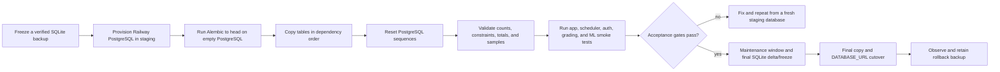
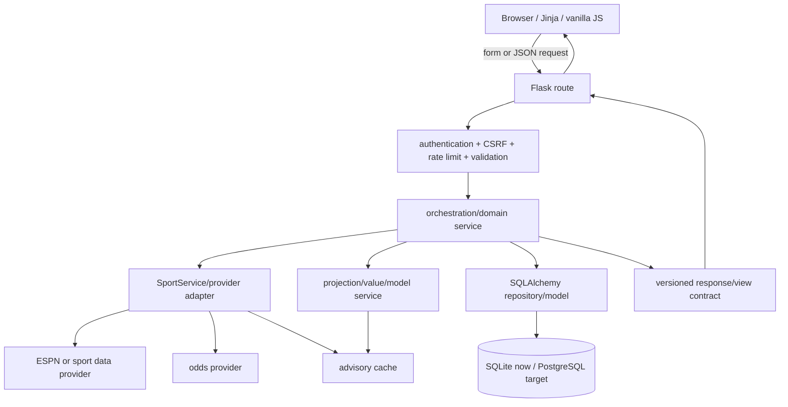
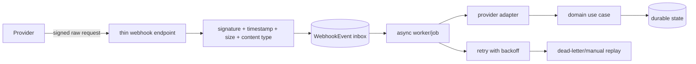

# Edge Tracker Launch Readiness and Multi-Sport TODO

Status: planning and audit document; no implementation is authorized by this file  
Audit date: 2026-08-10  
Repository baseline: `main` at `6b1e400`  
Coordination note: Claude is actively changing the design system and Playwright
fixtures. This document was created in isolation; none of those active files were
modified.

This is the prioritized implementation backlog for security, deployment,
multi-sport expansion, architecture, error handling, SEO, webhooks, and caching.
The architecture registry in `docs/architecture/system-contract.md` is the
intended single source of truth for module boundaries and shared schemas. It is
currently present in the working tree but is not part of the `6b1e400` baseline;
coordinate its eventual commit with the other active work before treating it as
published.

## Status legend

- `[x]` implemented and verified in the current baseline or directly observed
- `[-]` foundation exists, but the capability is incomplete
- `[ ]` not implemented or still needs verification
- **P0** required before a public production launch
- **P1** required for a reliable first launch or before multi-sport work
- **P2** important follow-up after the launch foundation is stable
- **P3** later optimization

## 1. Current-state snapshot

| Area | What has already been worked | What remains |
|---|---|---|
| ML validation | Under/overfitting diagnostics, mandatory temporal Model 2 partitions, real quote ingestion/capture contracts, rolling-origin evaluation, and ROI/CLV/drawdown/Kelly gates are merged | Accumulate or import enough licensed real prop decision/closing lines; run repeated shadow evaluations; profitability is not yet proven |
| Shared architecture | A dependency map, shared schemas, state rules, and module ownership registry exist in `docs/architecture/system-contract.md` | Reconcile with Claude's work, commit it, add architecture tests to CI, and keep it synchronized with executable contracts |
| Login security | Passwords are hashed with Werkzeug; CSRF, login/register rate limits, POST logout, hardened production session/remember cookies, bounded session lifetimes, a 12–256 character password policy, CSP, HSTS, frame blocking, and generic login failures exist | Account recovery/verification, auth audit logging, breached-password coverage, shared rate-limit storage, and broader security review |
| Browser persistence | The versioned parlay queue is the only active app-managed browser key; its contents/lifecycle are inventoried and current/legacy keys clear on logout | Keep the inventory and logout browser regression synchronized with any new browser state |
| Environment/secrets | `.env` is ignored; `.env.example` inventories runtime variables with safe defaults; `SECRET_KEY` is required; CI enforces the environment contract, dependency audit, and tracked/history secret scans | Store production values only in Railway variables and establish the operational rotation schedule when hosting is restored |
| Database/deployment | SQLAlchemy accepts SQLite or `DATABASE_URL`; `postgres://` is normalized; psycopg is installed; Alembic, Docker, Gunicorn, `/health`, and `/ready` exist | Test the complete migration chain on PostgreSQL, build a data-copy validator, use Railway pre-deploy migrations, establish backup/rollback, and separate web/scheduler ownership |
| MLB/NFL | Sport stat catalogs exist for NBA, MLB, and NFL; `HistoricalGameLog` and scenario tables include `sport`; a `SportService` interface exists | Only NBA has a registered service. Bet/snapshot/context schemas, providers, features, models, calibration, grading, routes, schedules, and tests remain sport-specific or absent |
| Error pages | Custom 404 and 500 templates exist | Add negotiated 400/401/403/405/429/502/503/505 handling, request IDs, monitoring, accessibility, and visual fixtures |
| Breadcrumbs | `base.html` has a `topbar_breadcrumb` block | Define a shared breadcrumb contract/helper, render accessible navigation, and add structured data only on indexable public pages |
| SEO/crawlers | Public home page exists | Metadata contract, canonicals, robots.txt, sitemap.xml, Open Graph, responsible-gambling/legal content, structured data, and crawler tests are absent |
| Caching | Several process-local TTL caches reduce NBA/provider/model work | No shared cache, key registry, cross-worker invalidation, metrics, or durable cache policy |
| Webhooks | None | Provider-neutral signed ingestion, replay/idempotency controls, async processing, retry/dead-letter behavior, and operations tooling |

## 2. Recommended implementation order

```text
P0-A security/privacy and secrets
  -> P0-B PostgreSQL compatibility and deployment topology
    -> P1-C shared contracts, route boundaries, and refactor seams
      -> P1-D shared cache and webhook event foundation
        -> P1-E custom errors and public-site/SEO foundation
          -> P2-F MLB vertical slice
            -> P2-G NFL vertical slice
              -> P3-H optimization and scale testing
```

Do not begin MLB and NFL by copying `nba_service.py`. First make identifiers,
events, bets, quotes, snapshots, and model versions explicitly sport-aware.
Otherwise every copied service will preserve NBA assumptions and multiply the
migration cost.

## 3. P0 — Authentication, session, and local-persistence security

### Already in place

- [x] `User.password_hash` stores a one-way Werkzeug password hash, not the
  plaintext password.
- [x] Login failures use a generic message.
- [x] Login and registration are rate limited.
- [x] State-changing form routes use Flask-WTF CSRF protection; logout is POST.
- [x] The main user-owned bet routes require authentication and generally scope
  reads/writes to `current_user.id`.
- [x] Production sessions default to `Secure`, `HttpOnly`, and `SameSite=Lax`.
- [x] HSTS, CSP, `X-Content-Type-Options`, `X-Frame-Options`, and referrer policy
  are configured.
- [x] No app-managed browser storage of credentials, Flask session tokens, or API
  keys was found.

### Findings and work items

- [x] **P0: clear the real parlay storage key on logout.** The queue is stored in
  `sessionStorage` as `sbt_parlay_queue_v1`; the current logout script clears only
  the retired `parlayQueue` key. Clear both during the compatibility period, call
  the shared `clearParlayQueue()` function, and add a Playwright test covering
  logout then login as a different user in the same tab.
- [x] **P0: document browser persistence.** Keep an inventory of cookie names,
  browser keys, contents, purpose, lifetime, and deletion event. Limit the parlay
  queue to non-sensitive bet composition; do not add bankroll notes, email,
  tokens, or provider payloads.
- [x] **P0: inspect real cookies in a controlled response test.** Assert the
  session and remember cookies contain no password/email/API secret, have the
  expected `Secure`, `HttpOnly`, and `SameSite` flags in production mode, and are
  removed/invalidated on logout as intended.
- [-] **P0: harden remember-me separately.** Explicitly set
  `REMEMBER_COOKIE_SECURE`, `REMEMBER_COOKIE_HTTPONLY`,
  `REMEMBER_COOKIE_SAMESITE`, and a documented duration. Rotate or invalidate
  persistent sessions after password reset/change.
- [-] **P0: replace the six-character password minimum.** Prefer a minimum of 12
  characters while allowing long passphrases; set a high maximum to prevent
  resource abuse; reject common/breached passwords without restrictive composition
  rules. Add tests for Unicode, long input, and denial-of-service bounds.
- [x] **P0: define session lifecycle.** Choose idle and absolute lifetimes, enable
  Flask-Login session protection, require fresh authentication for email/password
  or bankroll-security changes, and document multi-device logout behavior.
- [ ] **P0: move production rate limits to a shared store.** `memory://` produces
  per-worker counters. Configure Redis through `RATELIMIT_STORAGE_URI`, test fail
  behavior, and monitor 429 rates.
- [ ] **P0: test object ownership/IDOR systematically.** User B must receive the
  chosen non-disclosing response when reading, editing, grading, deleting, or
  exporting User A's bets/parlays/context. Prefer querying by both object ID and
  `user_id` instead of fetching first and checking ownership afterward.
- [-] **P0: protect telemetry.** Keep `/telemetry/ux` payloads allowlisted and
  bounded, never accept credentials/free-form private notes, add bot/abuse
  monitoring, and document why this endpoint is CSRF-exempt.
- [ ] **P1: reduce account enumeration.** Decide whether duplicate registration
  should reveal username/email existence. If privacy wins, use a generic response
  and handle email delivery separately.
- [ ] **P1: add auth event logging.** Record login success/failure, logout,
  password/reset changes, lockouts, and suspicious rate-limit events with request
  IDs. Never log passwords, cookies, reset tokens, raw secrets, or full provider
  payloads.
- [ ] **P1: add account lifecycle features.** Email verification, signed
  single-use password reset with short expiry, password-change session invalidation,
  and optional MFA/passkeys. Do not expose whether an email is registered in reset
  responses.
- [ ] **P1: add progressive abuse controls.** Combine IP/account throttling with
  increasing delay; avoid a permanent lockout that attackers can weaponize.
- [ ] **P1: reconcile the CSP with the local design system.** Remove obsolete
  external font/CDN origins after Claude's design work settles and eliminate
  `'unsafe-inline'` for styles through nonces/hashes or owned static CSS where
  feasible.
- [x] **P1: automate security gates.** Add dependency vulnerability review,
  secret scanning, SAST, CSRF/auth/IDOR tests, and a production-header test to CI.

### Acceptance evidence

- [ ] Two-user browser and request-level security suite passes.
- [x] Production-cookie assertions pass with no sensitive payload discovered.
- [x] Logout clears every documented user-specific browser key.
- [ ] Redis-backed rate limiting works across two Gunicorn workers.
- [ ] Security logs contain request correlation but no secrets or sensitive form
  data.

## 4. P0 — Environment and secret contract

Use two files for two different purposes:

- `.env` remains ignored and contains real local values only.
- `.env.example` remains tracked and contains names, safe defaults, and blank or
  obvious non-secret placeholders only.

Never put real secrets in the example, Docker image, JavaScript, templates,
browser-injected configuration, logs, test fixtures, or the brain vault.

### Work items

- [x] `.env` and `.env.backup` are ignored by Git.
- [x] A tracked `.env.example` exists.
- [x] **P0: expand `.env.example` from the executable inventory.** Categorize
  variables as required, optional, provider-specific, tuning, or Railway-injected.
- [x] **P0: add an env-contract test.** Every operator-facing `os.getenv()` name
  must be declared in `.env.example` or explicitly allowlisted as internal or
  platform-injected. The test should fail on undocumented new variables.
- [x] **P0: add secret scanning before commit and in CI.** Scan tracked content and
  Git history using a maintained tool; verified false positives should use narrow
  suppressions with comments.
- [ ] **P0: put production values in Railway service variables.** Use reference
  variables for PostgreSQL and Redis. Never copy database credentials into a
  tracked file.
- [ ] **P0: define secret rotation.** Cover Flask secret, Odds API key, webhook
  signing secrets, email credentials, object-store keys, and observability tokens.
  Record owner, rotation cadence, and blast radius without recording values.
- [ ] **P1: separate public configuration from secrets.** Only explicitly
  publishable IDs may reach client-side code; all other variables remain server
  side.

### Operator-facing inventory to reconcile

Required/current runtime:

```dotenv
SECRET_KEY=
DATABASE_URL=sqlite:///app.db
ODDS_API_KEY=
FLASK_DEBUG=false
FLASK_ENV=production
SESSION_COOKIE_SECURE=true
SCHEDULER_ENABLED=false
RATELIMIT_ENABLED=true
RATELIMIT_STORAGE_URI=
WEB_CONCURRENCY=2
DB_POOL_SIZE=2
DB_MAX_OVERFLOW=3
AUTO_DB_UPGRADE=false
MIGRATION_MAX_SECONDS=45
```

Model and betting flags/tuning that need documentation:

```dotenv
USE_ML_PROJECTIONS=false
USE_DISTRIBUTIONAL_MODEL=false
USE_SCENARIO_SIGNAL=false
MODEL2_INCLUDE_PAPER_COHORTS=false
AUTO_PICKS_ON_LOGIN=false
AUTO_PAPER_ENABLED=false
AUTO_PAPER_MAX_PER_COHORT=
AUTO_PAPER_MIN_GAMES=
AUTO_PICK_MAX_TOTAL=
AUTO_PICK_MIN_EDGE_STRAIGHT=
AUTO_PICK_MIN_EDGE_2LEG=
AUTO_PICK_MIN_EDGE_3LEG=
AUTO_PICK_MIN_GAMES=
AUTO_PICK_CONFIDENCE_TIER=
MONEYLINE_RECS_ENABLED=true
TOTAL_RECS_ENABLED=true
MARKET_REC_MIN_EDGE_ML=
MARKET_REC_MIN_CONF_ML=
MARKET_REC_MIN_EDGE_TOTAL=
MARKET_REC_MIN_CONF_TOTAL=
```

Ingestion, governance, and API-budget variables that need documentation:

```dotenv
ENABLE_NBA_API_PLAYER_REFRESH=false
ODDS_API_BUDGET_FLOOR=25
ODDS_API_HISTORICAL_SNAPSHOT_HOUR_UTC=18
GAME_SNAPSHOT_BACKFILL_DAYS=
GAME_SNAPSHOT_BACKFILL_SLEEP=
HISTORICAL_ODDS_INGEST_DAYS=
HISTORICAL_ODDS_INGEST_FORCE=false
HISTORICAL_ODDS_INGEST_SLEEP=
MARKET_COVERAGE_DAYS=
MARKET_COVERAGE_STEP_DAYS=
MARKET_COVERAGE_TEST_DAYS=
MARKET_COVERAGE_TRAIN_DAYS=
MARKET_GOV_APPLY=false
MARKET_GOV_BINS=
MARKET_GOV_DAYS=
MARKET_GOV_DRIFT_THRESHOLD=
MARKET_GOV_MIN_BETS=
MARKET_GOV_STEP_DAYS=
MARKET_GOV_TEST_DAYS=
MARKET_GOV_TRAIN_DAYS=
```

Storage and future integration variables:

```dotenv
MODEL_STORAGE=local
S3_MODEL_BUCKET=
S3_MODEL_PREFIX=models/
AWS_REGION=
AWS_ACCESS_KEY_ID=
AWS_SECRET_ACCESS_KEY=
REDIS_URL=
WEBHOOK_SIGNING_SECRET_PRIMARY=
WEBHOOK_SIGNING_SECRET_SECONDARY=
SENTRY_DSN=
EMAIL_PROVIDER=
EMAIL_API_KEY=
EMAIL_FROM_ADDRESS=
```

`PORT` and `RAILWAY_ENVIRONMENT` should be documented as Railway-injected, not
operator secrets. `RUNNING_CLI` is internal process state and should not be
presented as an operator setting.

The tracked example now uses the verified local convention, `sqlite:///app.db`,
and a contract test protects that value. Risky automation is also explicitly
disabled in the example: `AUTO_PAPER_ENABLED=false` and `MARKET_GOV_APPLY=false`.

## 5. P0 — SQLite to Railway PostgreSQL transition map

The application already supports a `DATABASE_URL`, but changing that URL creates
or targets a different database; it does not copy the data in
`instance/app.db`. A tested ETL/cutover is required.



### Phase 1 — compatibility before data movement

- [ ] **P0: run the complete Alembic upgrade chain on the same PostgreSQL major
  version used by Railway.** Add this to CI with a disposable PostgreSQL service.
- [ ] Test downgrade only where migrations promise it; production rollback should
  prefer application rollback plus a compatible forward migration.
- [ ] Audit SQLite/PostgreSQL differences: Boolean defaults, constraint names,
  case-insensitive matching, JSON behavior/indexing, timezone-aware datetimes,
  floating/decimal money, unique-null behavior, and transaction isolation.
- [ ] Add `sport` and provider namespace changes before copying if those schema
  changes are required for the first deployed version.
- [ ] Confirm database pool size against worker count, scheduler connections, and
  Railway connection limits.
- [ ] Make `/ready` verify only required dependencies and remain bounded; keep
  `/health` as a cheap liveness probe.

### Phase 2 — build a repeatable copy and validator

- [ ] Create a dedicated CLI such as `flask migrate-sqlite-to-postgres` with
  `--source`, `--target`, `--dry-run`, `--batch-size`, and `--validate-only`.
- [ ] Refuse identical source/target and refuse a non-empty target unless an
  explicit safe resume mode is proven.
- [ ] Copy in foreign-key/topological order while preserving primary keys and
  event/provider identifiers.
- [ ] Use transactions and bounded batches; emit counts and sanitized progress,
  never connection URLs.
- [ ] Make the process restartable with a migration-run record or deterministic
  idempotency keys.
- [ ] Reset every PostgreSQL identity/sequence to `max(id) + 1` after preserving
  IDs.
- [ ] Validate per-table row counts, required nullability, unique keys, foreign
  keys, representative JSON payloads, bet totals/P&L, user bet counts, historical
  log counts by season/sport, quote counts by kind/book, and model metadata/artifact
  references.
- [ ] Produce a machine-readable validation report and a human cutover summary.

### Phase 3 — Railway deployment topology

- [ ] Provision separate staging and production environments.
- [ ] Add PostgreSQL and Redis inside the same Railway project/environment and
  use private/reference variables.
- [ ] Move Alembic from every web-container startup to a Railway pre-deploy command
  or a single controlled migration job. A failed migration must stop deployment.
- [ ] Remove the misleading entrypoint comment that says migration failure is
  allowed when non-timeout failures currently stop startup; decide and test the
  intended behavior.
- [ ] Deploy one web service with `SCHEDULER_ENABLED=false`.
- [ ] Deploy exactly one scheduler service/process with
  `SCHEDULER_ENABLED=true`; prove two schedulers cannot accidentally run the same
  jobs.
- [ ] Use Redis for rate limiting and shared caches before using multiple web
  workers/replicas.
- [ ] Verify Gunicorn bind/port behavior, proxy headers, HTTPS redirects, secure
  cookies, request IDs, log redaction, and health checks behind Railway.
- [ ] Configure scheduled Railway volume/database backups and periodically test a
  restore. Also retain an independent pre-cutover SQLite backup and a database
  export appropriate to PostgreSQL.

### Phase 4 — production cutover and rollback

- [ ] Announce a maintenance/read-only window; stop bet writes and the scheduler.
- [ ] Create and checksum the final SQLite backup.
- [ ] Run the final copy and validation against a clean production PostgreSQL
  schema.
- [ ] Switch only `DATABASE_URL`/reference variables; do not rebuild with secrets.
- [ ] Smoke-test registration/login/logout, two-user isolation, dashboard totals,
  bet create/edit/delete/export, NBA pages, quote capture, grading, scheduler
  singleton, CLI commands, model artifact loading, and readiness.
- [ ] Observe error rate, latency, connections, job duplication, and data drift for
  a defined period.
- [ ] Roll back by stopping writes, restoring the pre-cutover configuration and
  immutable SQLite backup, and reconciling any PostgreSQL-only writes. Write and
  rehearse this procedure before cutover.

Railway references used for this plan:

- [PostgreSQL service and connection variables](https://docs.railway.com/databases/postgresql)
- [Pre-deploy commands](https://docs.railway.com/deployments/pre-deploy-command)
- [Private networking](https://docs.railway.com/private-networking)
- [Volume/database backups](https://docs.railway.com/volumes/backups)

## 6. P1 — Routing and application data-flow map

The current Flask app registers 32 non-static URL rules. Keep the generated
`app.url_map` inventory as a test artifact so this map cannot silently drift.

### Route groups

| Surface | Current routes | Policy |
|---|---|---|
| Public site | `/` | Indexable only after public copy/legal/metadata are ready |
| Authentication | `/auth/register`, `/auth/login`, `/auth/logout` | Noindex; CSRF on mutations; strict rate limits |
| User application | `/dashboard`, `/dashboard/settings`, `/bets*`, quick-add/import/export/edit/delete/grade/parlay | Authenticated; private/noindex; all records user-scoped |
| NBA application/API | `/nba/today`, analysis/stat/player pages, props/progress/upcoming/update/place | Authenticated; private/noindex; normalize provider data before routes |
| Operations | `/health`, `/ready`, `/ready/model2` | Minimal response; no secrets, versions, paths, or stack traces |
| UX telemetry | `/telemetry/ux` | Public POST, rate-limited, strict allowlist, no sensitive payload |

### Canonical request/data flow



Scheduled/CLI flow:

```text
APScheduler or Flask CLI
  -> application orchestration service
    -> sport adapter / quote capture / grading / ML evaluation
      -> transactional SQLAlchemy writes + JobLog/ModelEvaluationRun
```

### Work items

- [ ] Generate a route catalog in tests containing methods, path, endpoint,
  authentication policy, CSRF policy, response type, owner, and rate-limit class.
- [ ] Fail CI when a new mutating route lacks an explicit auth/CSRF/rate-limit
  classification.
- [ ] Give HTML and JSON endpoints a versioned response/error contract; do not let
  browser JavaScript depend on provider-native payloads.
- [ ] Move route-to-route private helper imports into services or pure utilities.
- [ ] Add request IDs at the edge and propagate them through provider, database,
  scheduler, and webhook logs.
- [ ] Normalize all identifiers as `(sport, provider, entity_type, external_id)`;
  never infer an ESPN ID is an Odds API ID.
- [ ] Keep ET for business slate/date decisions, but persist event timestamps in
  timezone-aware UTC and convert at the display/business boundary.

## 7. P1 — Refactor centralized modules for reuse

This should be an incremental modular-monolith refactor with characterization
tests, not a rewrite.

Largest Python concentration points at audit time:

| File | Approx. lines | Target responsibility split |
|---|---:|---|
| `services/nba_service.py` | 1,562 | ESPN adapter, odds adapter, normalizers, snapshot repository, grading policy, NBA facade |
| `services/scheduler.py` | 1,469 | job registry, job functions by domain, singleton/lease policy, observability |
| `cli/model_commands.py` | 1,328 | training, diagnostics, backtests, readiness commands |
| `services/market_recommender.py` | 1,039 | datasets, feature/model logic, promotion/governance policy |
| `models.py` | 886 | identity/betting, sport data, ML/ops model modules with one exported registry |
| `services/value_detector.py` | 872 | quote normalization, projection scoring, edge policy, orchestration |
| `services/pick_quality_model.py` | 835 | dataset, features, split/train, calibration/inference, persistence |
| `services/stats_service.py` | 765 | NBA provider fetch, cache repository, summaries, reconciliation |
| `routes/nba_live.py` | 663 | HTML handlers, JSON progress handlers, snapshot orchestration |

The CSS design-system split is intentionally deferred until Claude completes the
active design pass.

### Proposed package boundaries

```text
app/
  contracts/          # typed/versioned boundary schemas and errors
  domain/
    betting/           # entities/policies/settlement/postmortem
    sports/            # sport-neutral events, markets, IDs
    ml/                # feature, prediction, calibration contracts
  integrations/
    espn/
    odds_api/
    webhooks/
  sports/
    nba/
    mlb/
    nfl/
  repositories/       # persistence queries, no provider HTTP
  services/           # cross-domain use cases/orchestration
  routes/              # thin HTML/JSON entrypoints
  jobs/                # thin scheduled entrypoints
  cli/                 # thin operator entrypoints
```

### Refactor sequence

- [ ] Add characterization/contract tests around current normalized game, prop,
  projection, progress, grading, and error payloads.
- [ ] Extract pure provider normalizers first; no database or Flask imports.
- [ ] Extract repositories for user-scoped bets, snapshots, logs, quotes, and model
  metadata.
- [ ] Extract sport-neutral market and identifier types.
- [ ] Make `NBAService` compose adapters/repositories/policies rather than own all
  implementation.
- [ ] Split scheduler jobs by domain while keeping one explicit job registry and
  one singleton policy.
- [ ] Split CLI command modules by use case while preserving command names.
- [ ] Split SQLAlchemy model declarations only after resolving import/metadata and
  migration conventions; keep `app.models` compatibility exports during migration.
- [ ] Enforce dependency direction with an import-boundary test.
- [ ] Delete compatibility shims only after all consumers and tests move.

## 8. P2 — MLB and NFL implementation breakdown

### Can the same models be reused?

| Layer | Reuse verdict | Required change |
|---|---|---|
| XGBoost training/evaluation framework | Yes | Parameterize sport, target, feature schema, split cadence, artifact namespace, and thresholds |
| Rolling temporal backtest and economic metrics | Yes | Use sport-appropriate fold units and real sport/book quote joins |
| Calibration framework | Yes | Train independent calibrators by sport/market/role; never share NBA calibration |
| NBA 30-feature Model 1 matrix | No | Build sport-specific feature contracts; NBA shooting/usage/pace fields do not describe MLB/NFL |
| Existing trained NBA artifacts | No | Train new MLB/NFL artifacts from their own point-in-time data |
| Distribution choice | Partial | Validate per market; count/zero-inflated/negative-binomial or quantile heads may differ |
| Model 2 classifier architecture | Partial | The algorithm can be reused, but market/context categories, feature definitions, temporal splits, calibration, and promotion are sport-specific |
| Scenario engine concept | Yes | Add sport-specific dimensions/buckets and point-in-time context packs |
| `SportService` interface | Partial | Add richer event/participant/role/market contracts and provider namespace support |

### Shared multi-sport foundation — do before either sport

- [ ] Add a controlled `Sport` vocabulary and canonical market registry.
- [ ] Add `sport` to `Bet`, `GameSnapshot`, `OddsSnapshot`, `HistoricalGameOdds`,
  `TeamDefenseSnapshot`, `InjuryReport`, and other durable records that can contain
  more than NBA data. Include `sport` in uniqueness/index keys.
- [ ] Rename NBA/provider-specific columns such as `espn_id` only through a
  migration/compatibility plan; prefer generic `event_id` plus `event_provider`.
- [ ] Define `ParticipantV1`, `EventV1`, `MarketV1`, `PropQuoteV1`,
  `StatLineV1`, and `ModelArtifactKeyV1` with sport and provider namespaces.
- [ ] Namespace model artifacts and metadata by sport, role, target, feature
  contract version, training window, and model version.
- [ ] Parameterize quote capture, freshness, grading, postmortems, routes,
  scheduler jobs, API budget, and cache keys by sport.
- [ ] Add a sport-aware navigation/URL convention such as `/<sport>/...` without
  duplicating route logic.
- [ ] Establish licensed/provider terms, quotas, attribution, historical depth,
  injury/lineup availability, and stable IDs before selecting data sources.
- [ ] Add provider contract fixtures and replay tests so CI does not depend on
  live APIs.

### MLB vertical slice

#### Data and domain

- [ ] Implement and register `MLBService` with schedule, scoreboard, boxscore,
  props, odds-event matching, progress, and grading.
- [ ] Model batter and pitcher roles explicitly; do not mix their samples or market
  catalogs.
- [ ] Ingest point-in-time probable/confirmed starters and batting order.
- [ ] Ingest batter/pitcher handedness, platoon splits, park factors, weather,
  umpire where licensed/reliable, team bullpen state, rest/travel, and lineup
  changes.
- [ ] Expand historical stats as needed: plate appearances, at-bats, singles,
  doubles, triples, hard-hit/contact indicators when available, innings/outs,
  pitches, earned runs, walks, hits allowed, and opponent quality.
- [ ] Define rainout, postponement, doubleheader, opener/bulk pitcher, pinch-hit,
  scratched starter, shortened game, and sportsbook void/push grading rules.
- [ ] Define supported first-release markets. Recommended narrow slice: pitcher
  strikeouts and batter total bases/hits before broader combinatorial props.

#### ML

- [ ] Create role/market-specific feature builders with one executable order shared
  by training and inference.
- [ ] Use date/time-aware splits that prevent same-game and later-line leakage;
  cluster evaluation by game and player.
- [ ] Compare quantile XGBoost, Poisson, negative binomial, and zero-inflated
  candidates per market rather than choosing one distribution globally.
- [ ] Calibrate probabilities per sport/market/role and apply conservative
  out-of-support fallback.
- [ ] Capture real decision/close lines and prices; gate promotion on calibration,
  coverage, CLV, ROI interval, drawdown, and repeated folds.
- [ ] Add residual slices by park, handedness, lineup position, starter status,
  weather band, pitcher/batter role, opponent quality, and season.

#### Product/operations

- [ ] Add MLB Today, prop analysis, bet entry, live progress, result grading, and
  postmortem paths through shared templates/components after Claude's design work
  settles.
- [ ] Add MLB scheduler cadence for daily lineups, scratches, weather, live games,
  finalization, quote snapshots, and historical reconciliation.
- [ ] Shadow MLB models before exposing recommendations.

### NFL vertical slice

#### Data and domain

- [ ] Implement and register `NFLService` with schedule, scoreboard, boxscore,
  props, odds-event matching, progress, and grading.
- [ ] Model positions/roles explicitly: QB, RB, WR, TE and relevant hybrid roles.
- [ ] Ingest point-in-time active/inactive status, injury practice reports, depth
  charts, starting role, snap share, routes, targets, carries, red-zone usage,
  offensive line context, opponent scheme/coverage where reliable, weather,
  surface, rest/travel, spread and total.
- [ ] Define overtime, stat correction, inactive player, limited snaps, postponed
  game, and sportsbook void/push rules.
- [ ] Start with a narrow supported market set: passing yards/attempts, rushing
  yards/attempts, receptions/receiving yards, then touchdowns after validating
  sparse-event calibration.

#### ML

- [ ] Build position/market-specific features. NBA minutes/usage and MLB plate
  appearances are not valid substitutes for NFL opportunity.
- [ ] Use week/season-aware expanding splits; prevent multiple props from the same
  game leaking across partitions.
- [ ] Account for small seasonal samples with multi-season decay, hierarchical or
  pooled priors, and explicit role-change detection.
- [ ] Model game-script dependence through pregame-known spread/total, team pace,
  pass rate over expectation, and opportunity projections.
- [ ] Validate quantile/count/hurdle models by target; touchdown markets need
  sparse-event treatment and conservative calibration.
- [ ] Add residual slices by position, snap/route tier, home/away, weather, injury
  status, rest, opponent, and season phase.
- [ ] Require the same real-line rolling economic gates as NBA/MLB, with game-level
  clustered confidence intervals.

#### Product/operations

- [ ] Add NFL weekly schedule, prop analysis, bet entry, live progress, grading,
  and postmortems through shared components.
- [ ] Use NFL-specific scheduler timing for practice reports, Friday/final injury
  status, Sunday inactives, late-window games, Monday games, stat corrections, and
  weekly reconciliation.
- [ ] Shadow NFL models before recommendations.

### Multi-sport acceptance gate

- [ ] No durable event, quote, bet, cache, or artifact can collide across sports.
- [ ] Provider contract fixtures pass for missing/changed fields.
- [ ] Training/inference feature hashes match for every sport/market.
- [ ] Point-in-time tests prove no lineup, injury, result, or closing-line leakage.
- [ ] Grading fixtures cover sport-specific cancellation/void/overtime rules.
- [ ] Each sport can be disabled independently with no effect on NBA.
- [ ] No model becomes active automatically from one backtest.

## 9. P1 — Custom error handling aligned with the design system

Wait for Claude's active design pass before changing shared templates/CSS or
visual baselines.

- [x] Custom HTML 404 and 500 templates exist.
- [ ] Define one error view model: status, public title/message, recovery action,
  request ID, and optional retry guidance. Never expose stack traces, SQL, paths,
  provider responses, or secrets.
- [ ] Add handlers/templates for 400, 401, 403, 404, 405, 429, 500, 502, 503, and
  505. In practice 502/503 will be more important than 505, but all requested
  statuses can share the system.
- [ ] Negotiate JSON errors for JSON/API routes and HTML for browser pages; use a
  stable `ApiErrorV1` shape with `code`, `message`, `request_id`, and safe details.
- [ ] Roll back the database session on server/database failures.
- [ ] Preserve the original status code and `Retry-After` where appropriate,
  especially 429/503.
- [ ] Add provider-specific safe mapping: timeout/unavailable -> 502/503, bad
  upstream payload -> safe degraded result or 502 according to route contract.
- [ ] Add a compact standalone layout for errors that still works if authenticated
  navigation or page data fails.
- [ ] Meet keyboard, focus, contrast, heading, reduced-motion, 320px, and screen
  reader requirements.
- [ ] Add Playwright desktop/mobile fixtures plus unit tests for HTML/JSON
  negotiation, request IDs, redaction, database rollback, and authenticated/public
  recovery actions.
- [ ] Connect unhandled 5xx events to monitoring with sampling and secret/PII
  scrubbing.

## 10. P1 — Breadcrumbs, SEO, and crawler readiness

Treat the public marketing site and authenticated application differently.
Private app pages should not be indexed, and `robots.txt` is not an access-control
mechanism.

### Metadata contract

- [ ] Add template blocks/defaults for unique title, meta description, canonical
  URL, robots directive, Open Graph, Twitter card, and optional structured data.
- [ ] Generate absolute canonical URLs from one configured public origin; enforce
  HTTPS in production and avoid query/filter/session URLs as canonicals.
- [ ] Apply `noindex, nofollow` to login/register, dashboard, bets, NBA/MLB/NFL
  app/analysis pages, error pages, and any page containing user-specific or rapidly
  changing private data.
- [ ] Keep only deliberate public pages indexable: home/landing, methodology,
  responsible-gambling, privacy, terms, contact/about, and public documentation if
  created.
- [ ] Do not publish fabricated win rates, model accuracy, testimonials, reviews,
  or profit claims. Explain that projections are informational and profitability
  is unproven until real-line validation qualifies.

### Breadcrumbs

- [ ] Replace one-off template strings with a shared list contract containing
  `label`, optional `url`, and `current`.
- [ ] Render `<nav aria-label="Breadcrumb"><ol>...</ol></nav>`; the current item
  uses `aria-current="page"` and is not a redundant link.
- [ ] Keep breadcrumbs consistent with route hierarchy and page heading.
- [ ] Emit `BreadcrumbList` JSON-LD only on indexable public pages, using absolute
  canonical URLs. Private in-app breadcrumbs are for usability only.
- [ ] Add unit and accessibility tests for escaping, missing parent routes, mobile
  overflow, focus, and current-page semantics.

### Crawler files and public trust

- [ ] Add dynamic `/robots.txt` with environment-aware behavior: disallow all in
  staging; in production allow only public pages and disallow private/auth/app,
  operational, and internal API paths.
- [ ] Add `/sitemap.xml` containing only canonical public 200 pages with truthful
  modification dates. Do not include auth, filters, errors, health/readiness, or
  user pages.
- [ ] Add tests for content type, absolute URLs, duplicate URLs, noindex/sitemap
  contradictions, and staging behavior.
- [ ] Add responsible-gambling, privacy, terms, data-source/attribution, model
  methodology/limitations, contact, and jurisdiction/age disclaimers before public
  launch. Obtain legal review appropriate to the intended jurisdictions.
- [ ] Add Organization/WebSite/SoftwareApplication structured data only where the
  page truthfully supports it; do not add ratings or offers that do not exist.
- [ ] Create a custom favicon/app icon and social preview image after the design
  direction is finalized.
- [ ] Register the final domain with Google Search Console only after canonical,
  sitemap, public copy, production HTTPS, and noindex rules pass staging review.

## 11. P1 — Future webhook architecture

Current sports providers are polled; there is no webhook endpoint. Build this
only when a provider or internal event source has a real webhook contract.



- [ ] Define a provider-neutral `WebhookEvent` inbox: provider, external event ID,
  event type, received/occurred timestamps, signature version, payload hash,
  status, attempt count, sanitized error, and processed timestamp.
- [ ] Capture the raw body before JSON parsing; verify provider-specific HMAC/public
  key signatures in constant time.
- [ ] Enforce a timestamp/replay window and support overlapping primary/secondary
  signing secrets during rotation.
- [ ] Limit body size/content type and rate limit by provider route; never log the
  raw body by default.
- [ ] Enforce idempotency with a unique provider/event key plus payload hash.
- [ ] Acknowledge only after durable inbox persistence. Keep domain work outside
  the request transaction.
- [ ] Normalize provider payloads into shared versioned contracts before calling
  betting, quote, injury, lineup, or result workflows.
- [ ] Implement bounded exponential retry with jitter, terminal/non-terminal error
  classes, a dead-letter state, alerting, and a safe operator replay CLI.
- [ ] Test valid/invalid signatures, stale timestamps, duplicate delivery,
  reordered events, changed duplicate payload, concurrent delivery, worker crash,
  database outage, rotation, and replay.
- [ ] Keep polling reconciliation even after webhooks so missed/out-of-order events
  heal from the provider source of truth.

## 12. P1 — Shared cache plan for odds, player stats, and model output

Current caches are process-local and include NBA game/upcoming data, 30-second
live summaries/progress, a five-minute scored-prop cache, projection-engine
instance caches, context/matchup caches, and player crosswalk memoization. They
do not coordinate across Gunicorn workers or a separate scheduler.

### Cache rules

- [ ] Introduce a `CacheService` interface with process-local test/dev and Redis
  production implementations.
- [ ] Keep PostgreSQL as durable truth. A cache may accelerate or serve bounded
  stale data, but must not be the only record of a quote, settled result, user bet,
  evaluation, or webhook.
- [ ] Create a key registry; do not scatter string construction through routes.
- [ ] Version keys by contract and include environment, sport, provider,
  event/player, market/line/book, model version, and feature fingerprint where
  applicable.
- [ ] Add TTL jitter, request coalescing/distributed locks, and stale-while-revalidate
  to prevent stampedes.
- [ ] Record hit/miss/stale/error/latency/eviction metrics without high-cardinality
  raw player or user labels.
- [ ] Define fail-open/fail-closed behavior per cache. Odds/display reads may
  degrade; auth, CSRF, webhook idempotency, settlement, and user ownership must not
  rely on an optional cache.
- [ ] Never cache user-private HTML/API responses in shared keys; if a user cache is
  justified, include user ID and short TTL and invalidate on mutation.

### Suggested policy matrix to validate with provider limits

| Data | Durable record | Suggested cache behavior | Invalidation |
|---|---|---|---|
| Pregame schedule | `GameSnapshot` where needed | 1-5 min, shorter near tip | event/provider update or TTL |
| Pregame odds/props | `OddsSnapshot` at decision/close windows | 30-60 sec with quota-aware stale fallback | new snapshot, line move, event start |
| Live scoreboard/player stats | finalized snapshot/log after game | 5-15 sec odds; 10-30 sec stats/progress | live event update/final |
| Final player game log | `HistoricalGameLog` | long TTL or immutable versioned key | correction/reconciliation event |
| Model output | evaluation/artifact metadata; quote decisions persisted | key by model+feature hash+line, short slate TTL | artifact activation, new stats/context/line |
| Scenario/context pack | persisted scenario tables | hours/day according to refresh job | atomic refresh/version bump |
| Rate limits | Redis | provider/framework-specific TTL | automatic expiry |

### Migration steps

- [ ] Inventory every existing cache key, owner, value schema, TTL, stale policy,
  size bound, and invalidation path.
- [ ] Add contract tests around current cache semantics before replacement.
- [ ] Move the scored-prop and live-summary caches first because they cross common
  web/scheduler paths.
- [ ] Add Redis integration tests with two app processes and one scheduler process.
- [ ] Add cache namespace version bump and emergency flush tooling scoped to a
  prefix—not a destructive global Redis wipe.
- [ ] Load-test stampede behavior, provider quota consumption, serialized value
  size, latency, Redis outage, and stale-data labeling.

## 13. ML validation work: completed versus operationally outstanding

The earlier five-point validation plan is infrastructure-complete in `44e5b2a`
and merged at `6b1e400`:

- [x] Explicit underfitting/overfitting diagnostics, learning curves, and residual
  slices.
- [x] Mandatory temporal fit/early-stop/calibration/test isolation for Model 2.
- [x] Historical/live real player-prop quote capture and import contract.
- [x] Rolling-origin retraining/backtest folds.
- [x] ROI, CLV, drawdown, Kelly, and edge-threshold metrics/promotion gates.

Remaining work is evidence acquisition and operation:

- [ ] Import licensed historical decision and closing prop lines, or accumulate
  sufficient live T-60/T-10 snapshots.
- [ ] Monitor join coverage, close coverage, fold count, sample independence, and
  missingness before interpreting profit metrics.
- [ ] Run consecutive shadow evaluations and require the defined two-run promotion
  rule; do not auto-activate a model.
- [ ] Obtain point-in-time injury/lineup history before claiming injury-segment
  performance.
- [ ] Extend the same program independently to MLB/NFL after their data contracts
  and feature builders exist.

## 14. Definition of done for this roadmap

A workstream is not complete because code exists. It is complete only when:

- [ ] The executable schema/feature/route owner and the system contract agree.
- [ ] Alembic migrations pass on fresh SQLite and fresh PostgreSQL where supported.
- [ ] Unit, integration, security, and browser tests cover success, failure,
  authorization, empty, stale, and degraded states.
- [ ] Ruff, Bandit, dependency/secret scanning, coverage, and CI pass.
- [ ] UI changes pass Claude's finalized design tokens, desktop/mobile visual
  baselines, accessibility, overflow, keyboard, and reduced-motion checks.
- [ ] Operational behavior has logs, request/job IDs, metrics, bounded retries,
  rollback, and a runbook.
- [ ] No secret or sensitive payload is written to Git, browser storage, logs,
  screenshots, fixtures, model metadata, or the shared brain.
- [ ] Deployment changes are first rehearsed in staging with backup and restore.
- [ ] Multi-sport recommendations remain shadow-only until real-line rolling gates
  qualify twice and activation is explicitly approved.

## 15. Coordination notes for Claude and Codex

- Claude currently owns the active design-system/templates/Playwright change set.
  Do not edit those files from this backlog until that work is handed off or
  committed.
- The security logout-key finding touches `base.html`/JavaScript and should wait for
  Claude's current pass or be sent as a narrowly scoped follow-up.
- Resolve/commit the architecture SSOT and its test separately from design changes
  if possible, then make this backlog link to the committed version.
- Implement each major section on a focused branch with a handoff that lists
  migrations, commands, tests, flags, rollback, and unresolved risks.
- Update this document in place as items land; do not create competing roadmap or
  architecture documents.

## Audit provenance

Repository evidence reviewed read-only:

- `app/__init__.py`, `app/forms.py`, `app/models.py`, `app/routes/`
- `app/services/base.py`, `sport_config.py`, NBA/provider/ML/cache services
- `app/static/js/utils.js`, `app/templates/base.html`, current error templates
- `.env.example`, `.gitignore`, `railway.toml`, `docker-entrypoint.sh`, Gunicorn
  configuration, migrations, tests, route map, and recent Git history
- shared brain nodes `wiki/edge-tracker.md`, `wiki/ml-validation-program.md`,
  `wiki/sport-stat-config.md`, `wiki/flask-app-architecture.md`,
  `wiki/deployment-consolidation.md`, `wiki/local-sqlite-database.md`, and
  `wiki/design-system.md`

This audit created only this document. It did not modify application source,
templates, CSS, Playwright fixtures, environment files, databases, brain nodes,
Git branches, commits, or remotes; unrelated active working-tree changes remain
owned by their existing authors.
